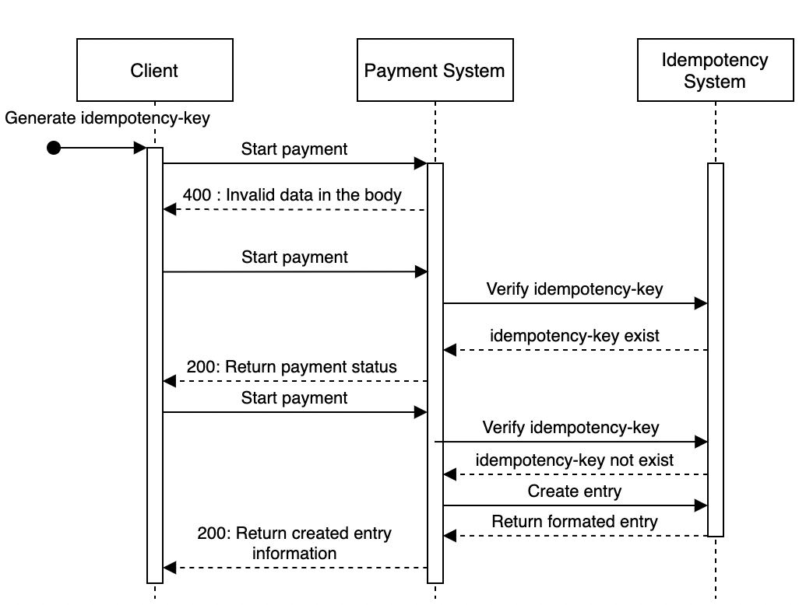

# CC2 Microservice
## Author 
- Hang DONG
- Ifzas NGUYEN

> _Pair programming_

## Usage
### Exemple
- Endpoints : http://localhost:8080/v1/payments/
- Header => idempotency-key : your-key-here
- Return => Status + Datetime
- Body => exemple :
```json
[
  {
    "buyer_info": [
      {
        "id": "first",
        "username": "username1",
        "firstName": "firstName1"
      }
    ],
    "checkout_id": "checkout_id1",
    "credit_card_info": [
      {
        "type": "type1",
        "code": "code1",
        "ccv": "ccv1",
        "expiry_date": "2020-01-01"
      }
    ],
    "payment_orders": [
      {
        "payment_orders_id": "payment_orders_id1"
      }
    ],
    "seller_account": "seller_account1",
    "amount": "50",
    "currency": "EUR",
    "payment_order_id": "1"
  },
  {
    "buyer_info": [
      {
        "id": "second",
        "username": "username2",
        "firstName": "firstName2"
      }
    ],
    "checkout_id": "checkout_id2",
    "credit_card_info": [
      {
        "type": "type2",
        "code": "code2",
        "ccv": "ccv2",
        "expiry_date": "2021-01-01"
      }
    ],
    "payment_orders": [
      {
        "payment_orders_id": "payment_orders_id2"
      }
    ],
    "seller_account": "seller_account2",
    "amount": "250",
    "currency": "EUR",
    "payment_order_id": "2"
  },
  {
    "buyer_info": [
      {
        "id": "third",
        "username": "username3",
        "firstName": "firstName3"
      }
    ],
    "checkout_id": "checkout_id3",
    "credit_card_info": [
      {
        "type": "type3",
        "code": "code3",
        "ccv": "ccv3",
        "expiry_date": "2022-01-01"
      }
    ],
    "payment_orders": [
      {
        "payment_orders_id": "payment_orders_id3"
      }
    ],
    "seller_account": "seller_account3",
    "amount": "500",
    "currency": "EUR",
    "payment_order_id": "3"
  }
]
```
> Do it twice to see the status of the payment.
First call return the JSON and second and other call return a status.

### Faking the payment service 
- Endpoints : http://localhost:8080/v1/status/{status}
- Header => idempotency-key : your-key-here **Same key as the payment**
- {status} value should be either Paid or Failed
- Return => Status + Datetime

> This endpoint's only purpose is to fake the callback option we give to the real payment service

## 

## API Sequence Diagram
> This diagram covers all 3 possibility this API gives for the retry pattern.
> 
